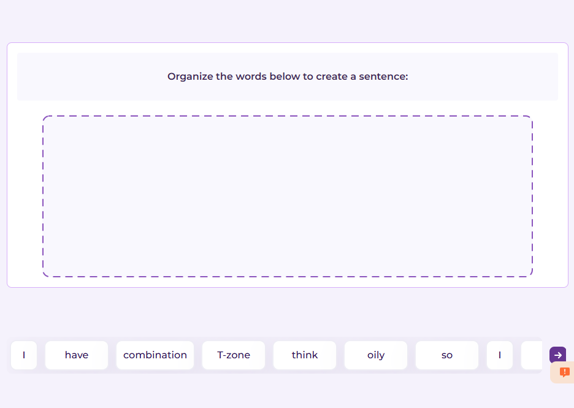
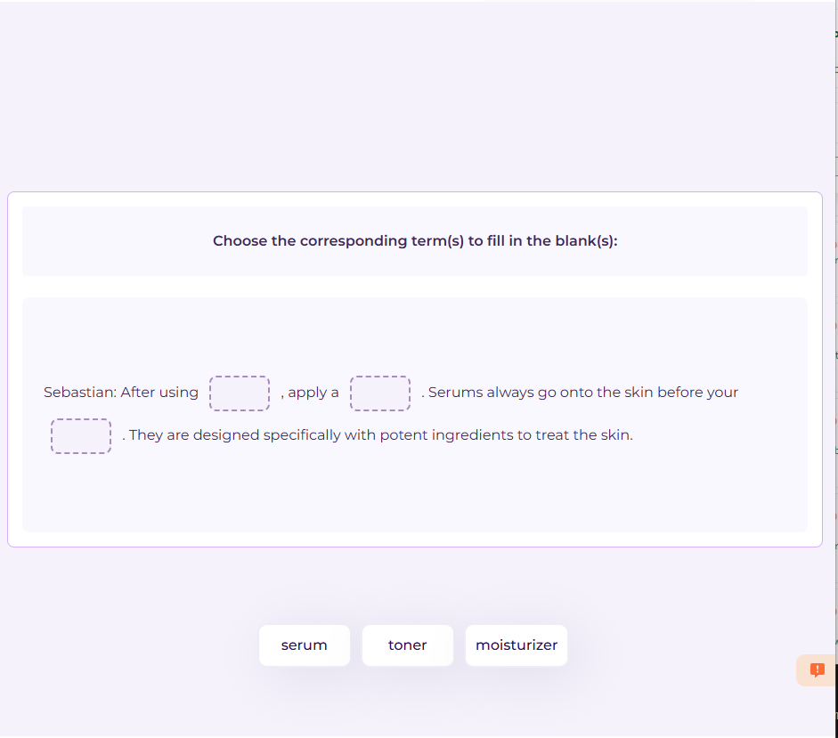
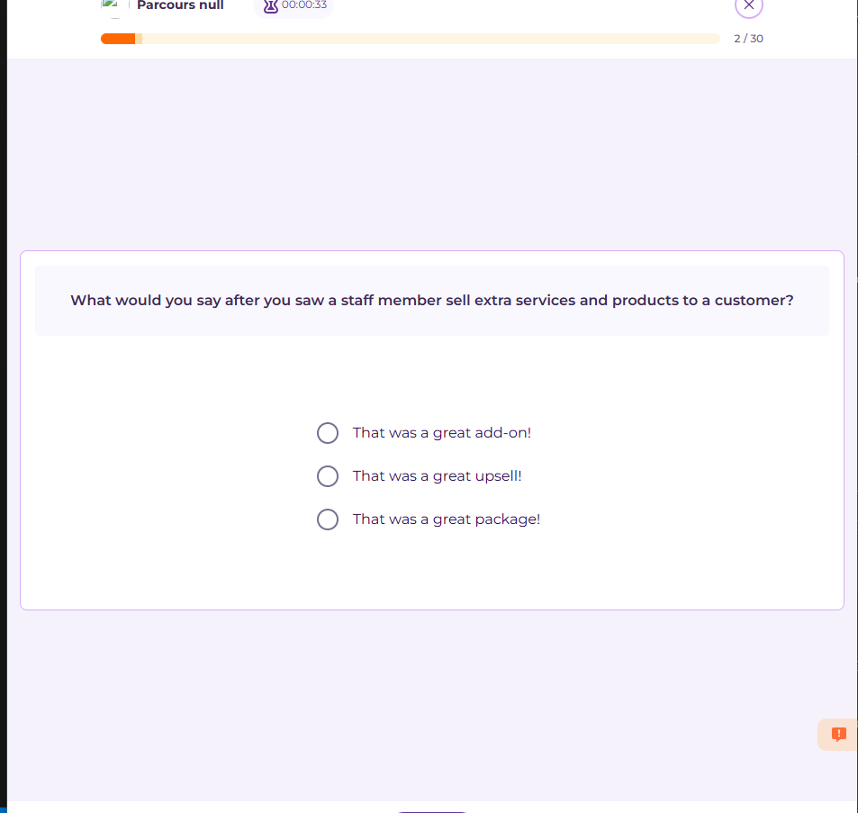
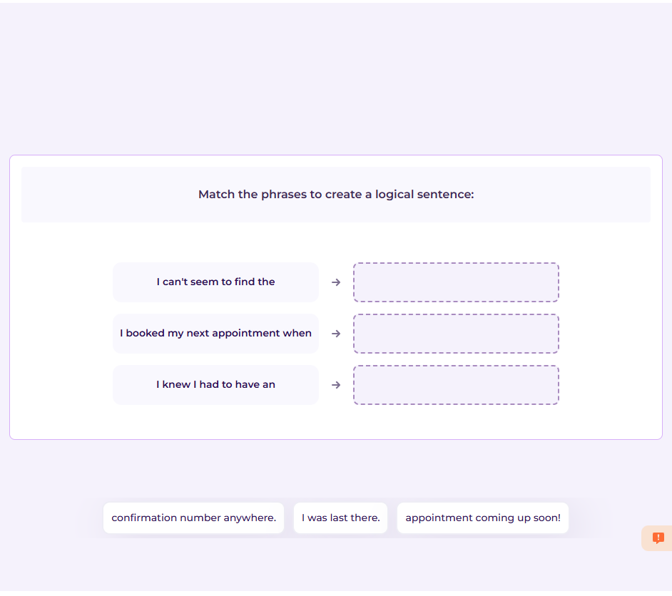

# GlobalExam Solver

Ce projet automatise la résolution d'exercices sur la plateforme **GlobalExam** en utilisant **Selenium**, **BeautifulSoup**, et **ChatGPT**. Il interagit automatiquement avec l'interface de GlobalExam, génère les réponses via ChatGPT, et stocke les résultats dans une base de données MongoDB.

---

## 🌐 Fonctionnalités principales

* Connexion automatique à GlobalExam et à ChatGPT (via compte Google)
* Extraction des questions d'exercices (drag & drop ou QCM)
* Génération automatique de réponses avec ChatGPT
* Sauvegarde des questions/réponses dans MongoDB pour réutilisation ultérieure
* Interface graphique (GUI) simple avec Tkinter pour lancer l'automatisation

---

## 🚀 Technologies utilisées

# Type 1: 


# Type 2: 


# Type 3: 


# Type 4: 



## 🚀 Technologies utilisées

* **Python 3.10+**
* **Tkinter** : interface utilisateur
* **Selenium + undetected\_chromedriver** : automatisation navigateur
* **BeautifulSoup** : parsing HTML
* **MongoDB** : base de données pour stocker les questions/réponses
* **ChatGPT** : génération intelligente de réponses

---

## 🔧 Prérequis

* Navigateur **Google Chrome** installé
* **MongoDB** en local (ou modifiez l'URI pour une base distante)
* Un compte **ChatGPT connecté via Google**
* Python et pip installés

---

## ⚙️ Installation

```bash
pip install -r requirements.txt
```

Si vous n'avez pas de `requirements.txt`, voici les principales dépendances :

```bash
pip install selenium undetected-chromedriver webdriver-manager pymongo beautifulsoup4
```

---

## 🔄 Lancement de l'application

Lancez simplement le script Python principal (celui contenant `tk.Tk()` en bas) :

```bash
python Certifications.py
```

Remplissez les champs requis dans l'interface :

* Identifiants GlobalExam
* Identifiants Gmail lié à ChatGPT
* Démarrez l'automatisation avec le bouton "Solve exercice"

---

## 🔒 Structure de la base MongoDB

* **Certificat** : contient le nom du certificat et les IDs d'exercices liés
* **Exercice** : contient la question textuelle et la réponse correspondante

---

## ⚡ Tips

* Le script divise l'écran en 2 : à gauche GlobalExam, à droite ChatGPT
* Les prompts sont conçus pour être précis, et vérifient que la réponse respecte les consignes (longueur, format, exactitude)
* Une mémorisation locale est utilisée pour accélérer la résolution d'exercices déjà rencontrés

---

## ⚠️ Limitations

* ChatGPT doit être connecté avec un compte Google (authentification semi-automatisée)
* Peut être sensible aux changements de structure HTML de GlobalExam ou ChatGPT

---

## 🚪 Quitter proprement

Cliquez sur "Exit" dans l'interface Tkinter ou fermez proprement le terminal.
